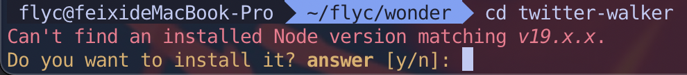
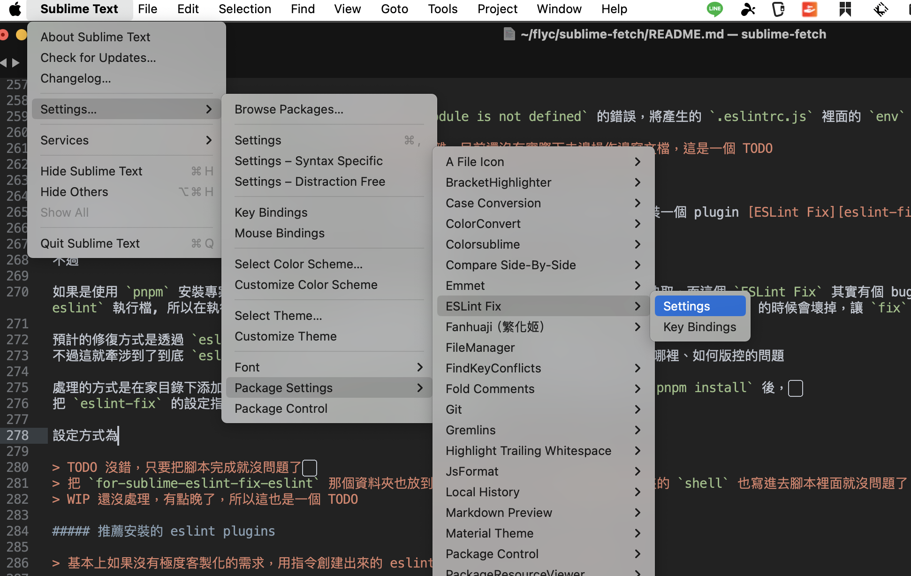
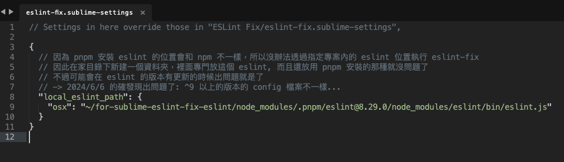
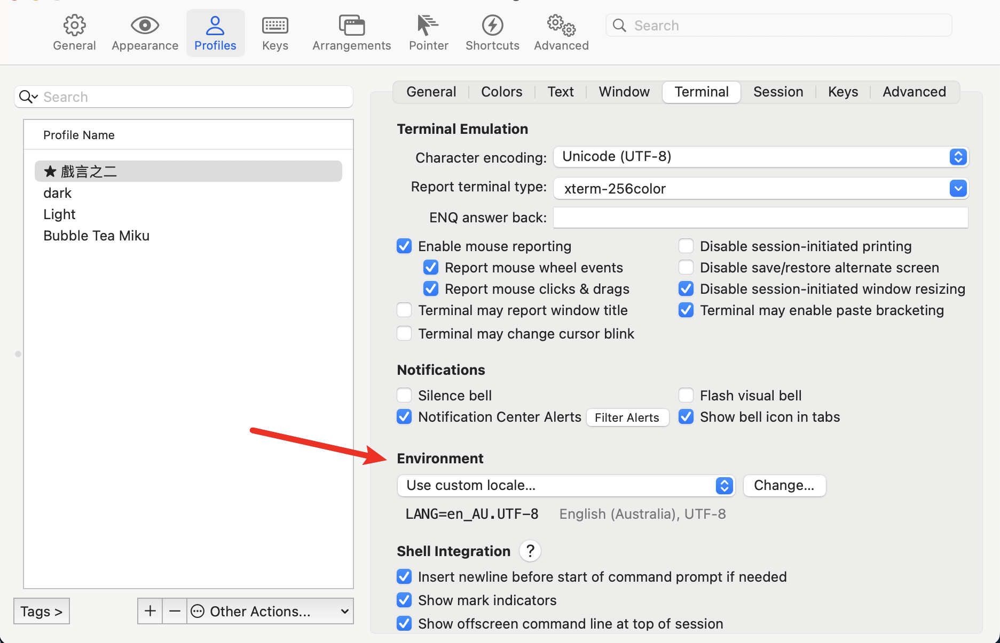
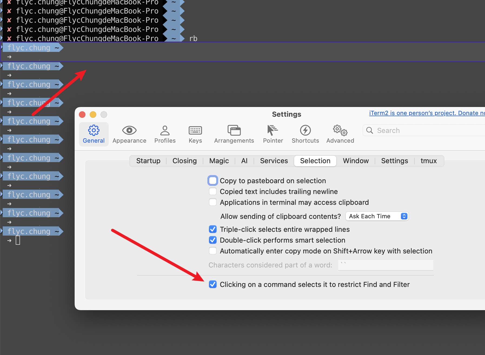

# 新 Mac 建構流程

## Mac 本身設定

1. 取消各種手勢(如五指收合、三指向上等等)
   > Setting -> Trackpad
2. 取消 Hot Corners 的行為(滑鼠移動到畫面角落的行為)
   > Setting -> Desktop & Dock -> Mission Control -> Hot Coners
3. Dock 縮小 + 放到左邊 + 自動隱藏
   > Setting -> Desktop & Dock -> Dock -> Position on screen: Left
4. 觸控板捲動方向調整(跟 windows 一樣)
   > Setting -> Trackpad
5. 拖拉方式修改(雙擊拖拉)
   > Setting -> Accessibility -> Pointer Control -> Trackpad Options -> Use Trackpad for dragging -> Dragging style: With Drag Lock
6. app 清單位置調整(setting 放第一個，狀態放最後一個等)
7. F1-F12 功能鍵變成不用搭配 fn
   > Setting -> Keyboard -> Press and fold fn key to: Show Expanded Control Strip
8. 快捷鍵: 勿擾模式(opt+s), app 清單(opt+q), spotlight/raycast 快捷鍵, 繁簡轉換, subWord 位移等
   > Setting -> Keyboard -> Keyboard shortcut

會根據不同的 Mac 型號 (如有沒有 touchbar 等) 有些不同

## 常用開發工具

[Snipaste](https://www.snipaste.com/): 強大的截圖程式

> Shortcut: 截圖: cmd+f1

[Karabiner Element](https://karabiner-elements.pqrs.org/): 外接鍵盤鍵位修改

[Rectangle](https://rectangleapp.com/): 快速移動視窗/最大化視窗

[Magnet](https://apps.apple.com/us/app/magnet/id441258766): 快速移動視窗/最大化視窗

> 全螢幕: ctrl + opt + super + enter  
> 位移螢幕: ctrl + shift + opt + arrow  
> 回去原本的尺寸: ctrl + shift + opt + enter

[Tweak](https://tweak-extension.com/): 簡潔好用的 Mock Data 用 Chrome 套件

[Raycast][raycast-link]: 用於取代 Mac Spotlight 的工具，他多了像是 Google Translation 和快速啟動 Bookmark 的功能等  
同步的話可以直接登入 Google 帳號即可

## Karabiner Element 鍵盤鍵位修改程式

複製資料夾即可

> 額外補充: [調整鍵盤背光快捷鍵設定方式][karabiner-keyboard-back-link]  
> 已經放在 `karabiner.json` 裡

```bash
cp -r ./karabiner $HOME/.config/karabiner
```

> 如果 Mac 預設找不到需要的權限的話，到這裡找  
> karabiner_grabber: `/Library/Application Support/org.pqrs/Karabiner-Elements/bin/karabiner_grabber`  
> karabiner_observer: `/Library/Application Support/org.pqrs/Karabiner-Elements/bin/karabiner_observer`  
> Karabiner-EventViewer: 在 `applicatoin 應用程式` 裡面就可以找到  
> source https://github.com/pqrs-org/Karabiner-Elements/issues/1867

## Sublime Text 編輯器

依照 [這裡](https://github.com/yayayahahaha/sublime3_package_backup) 的流程去處理  
或是直接安裝 `Package Control` 後關閉 `SublimeText`、接著執行 `set-sublime-text-user.sh` 即可

```bash
sh set-sublime-text-user.sh
```

> 如果要透過 `.sh` 執行同步的腳本但出現了 `zsh: permission denied` 的錯誤訊息  
> 請在該資料夾下新增的對 .sh 檔案的權限

> ```bash
> # https://andy6804tw.github.io/2020/07/21/linux-shell-script/
> chmod u+x *.sh
> ```

> 還沒處理掉 package 會噴的錯誤訊息:  
> It appears a package is trying to ignore itself, causing a loop.
> Please resolve by removing the offending ignored_packages setting.
>
> ---
>
> 1 missing dependency was just installed. Sublime Text should be restarted, otherwise one or more of the installed packages may not function properly.

## Sublime Merge

[官網](https://www.sublimemerge.com/) 安裝後，執行以下腳本

```bash
sh set-sublime-merge-user.sh
```

接著開啟 `Sublime Merge`, 嘗試看看 `ctrl + cmd + b` 有沒有辦法觸發 `Create Branch From Remote Branch` 即可

## Chrome 瀏覽器

登入即可同步大部分如書籤等等的設定，其他要調整的項目如下:

**`cmd + ,` 啟動 Preference** -> **隱私權、搜尋與服務** -> 最下方的**服務** -> **網址列和搜尋** -> **管理搜尋引擎**

添加以下 `Google Translator` 的快捷鍵

| 名稱         | 關鍵字 | URL                                                    |
| ------------ | ------ | ------------------------------------------------------ |
| 英文 to 中文 | tra    | `https://translate.google.com/?sl=en&tl=zh-TW&text=%s` |
| 中文 to 英文 | tras   | `https://translate.google.com/?sl=zh-CN&tl=en&text=%s` |

> 之前是用 Edge 瀏覽器，基本上只要登入 Chrome 後，設定就會有了

- Snippets 的相關檔案

> TODO Snippet 的部分直接放進來這個資料夾算了
> 可以參考[這裡](https://neotan.github.io/chrome-dev-tools-snippets/#step-2-export-backup-existing-snippets)

## Terminal 終端機

### 安裝 iterm2

直接從[官網](https://iterm2.com/)下載

#### 如何同步 profile

###### 自動

`Preferences -> General -> Preferences -> Load preferences from a custom folder or URL` 選擇此 repo 的位置即可

> 該行為會把此 `repo` 和 `iterm2` 當前的 `profile` 檔案同步

###### 手動

```bash
cp com.googlecode.iterm2.plist ~/Library/Preferences/com.googlecode.iterm2.plist
```

### 安裝 git

開啟 `iterm2` 後直接輸入 `git` 按確認，他會自己開始跑

`git` 權限的部分參考[這裡](./git-tech-center.md)

### 安裝 brew

> 安裝 `brew` 之前要裝 `git`, `brew` 在安裝的時候會需要

```bash
/bin/bash -c "$(curl -fsSL https://raw.githubusercontent.com/Homebrew/install/HEAD/install.sh)"
```

> TODO 安裝 `brew` 的時候似乎會動到 `.zprofile` ? 因為裡面多了一個檔案
> 這個也要去查

### 安裝 oh-my-zsh

```bash
sh -c "$(curl -fsSL https://raw.githubusercontent.com/ohmyzsh/ohmyzsh/master/tools/install.sh)"
```

##### oh-my-zsh 設定

###### Theme 設定

官方: [https://github.com/ohmyzsh/ohmyzsh/wiki/Themes](https://github.com/ohmyzsh/ohmyzsh/wiki/Themes)  
第三方: [https://github.com/ohmyzsh/ohmyzsh/wiki/External-themes](https://github.com/ohmyzsh/ohmyzsh/wiki/External-themes)

要使用官方文件裡的 `theme` 的話只要將 `$HOME/.zshrc` 裡的 ZSH_THEME='這裡' 填上想要的 `theme` 名稱後重啟即可  
如果要使用第三方的 `theme` 的話就參考每一個 repo 裡獨立的 README 即可

> TODO 感覺要備份整個 ~/.oh-my-zsh/custom 資料夾?  
> 如果有備份的話，重啟備份的順序就是 1. 先安裝 .oh-my-zsh 2. 把整個 custom 資料夾放進去

###### Color 設定

Iterm 的 `主題` 和 `顏色` 是可以分開設定的。顏色可以從 [這裡](https://iterm2colorschemes.com/) 挑選  
挑選完畢後只要將 color scheme 下載下來、再從 iterm 的 Profile -> Color 的右下角做 Import 就可以了

###### 字型設定

如果要使用 [`agnoster`](https://github.com/agnoster/agnoster-zsh-theme) 這個 `theme` 的話會要額外安裝字型

```bash
sudo apt-get install fonts-powerline
```

> [https://github.com/powerline/fonts](https://github.com/powerline/fonts)

> 安裝/同步完上述的項目後 `iterm2` 應該已經可以用 `option` 按鍵左右移動像是 `helloWorld` 等的字串單位了

### NodeJs

直接從[官網](https://nodejs.org/en/)安裝吧

> /usr/local/bin/node  
> /usr/local/bin/npm

安裝完 NodeJs 後，就安裝 `pnpm` 和 `n` 吧

```bash
sudo npm install --global pnpm n
```

#### 關於 n 和 fnm

[`n`](https://www.npmjs.com/package/n) 的細節待補上。

[`fnm`](https://github.com/Schniz/fnm) 可以透過在目錄底下添加一個 `.node-version` 的檔案，裡面直接就是 `nodejs` 版本號，

在切換進該目錄後會自動把 `NodeJs` 的版本切換到該版本下，非常方便。

安裝與設定方式如下:

```bash
brew install fnm

echo 16 > .node-version
# 創建一個 .node-version 的檔案，裡面寫 16
# fnm 配置設定完成後，切換到這個目錄時就會自動切換 NodeJs 的版本到 16
```

修改 修改 `.zprofile`, 添加以下指令

```bash
# ...
eval "$(fnm env --use-on-cd)"
# ...
```

完成



> 經過測試，在 `.zshrc` 和 `.zshprofile` 裡面添加都沒問題

其他一些 fnm 的指令介紹:

```bash
# Switch to specific version
fnm use {NODE_JS_VERSION} # If the NodeJs version is not installed, fnm will ask.

# Install specific version
fnm install {NODE_JS_VERSION}
```

#### 關於 Prettier

Sublime Text 使用的 `Prettier` plugins 是 [JsPrettier][jsprettier-link], 如果照著跑的話已經有安裝了  
其 `node_modules` 跟著專案走會比較 ok, 所以直接安裝在每個 project 很不錯

```bash
pnpm install prettier
# npm install prettier
```

當然如果要 global 安裝 prettier 也可以, 很適合在測試的時候只要存擋就可以快速排版

```bash
sudo npm install --global prettier

# command 完成後，透過以下指令確認安裝完成
npm list --depth=0 --global

# 可以看到安裝的相依版本號碼
```

只是如果是要推送出去的項目的話還是推薦安裝在專案層級, 這樣其他人才可以知道用的是 `prettier` 排版

設定檔的部分推薦直接複製這裡的 `.prettierrc.js` 放到家目錄下，  
不論是搭配專案內安裝的 `prettier` 或是 global 安裝的都可以，再搭配 `JsPrettier` 就可以運作了
當然也是推薦專案內也要有一個專案用的 `.prettierrc.js`, 這樣在與其他人協作的時候才可以共用同一份排版設定

> 如果專案內有 `.prettierrc.js` 的話，會以專案內的設定為主  
> _不會堆疊_ , 意思是如果 $HOME 的設定了 singleQuote 是 true, 但 $PROJECT 沒有設定的話  
> singleQuote 在執行時的設定會是預設的 false

請注意! `Prettier` 的設定檔如果是 `.prettierrc.js` 的話，會預設 `.js` 的檔案都是 `CommonJs`, 所以如果 `package.json` 裡有寫 `type` 是 `module` 的話, `prettier` 在執行的時候會噴錯。改法是把 `.prettierrc.js` 改成 `.prettierrc.cjs` 或將 `type` 使用成 `commonjs` 即可

> SublimeText 要叫出 prettier 的設定檔的指令是 `preferences: jsPrettier settings - side-by-side`  
> TODO Global 安裝的 jsPrettier 執行檔的部分的還沒有處理

### 關於 Eslint

`Sublime Text` 使用的 `Eslint` 的 plugins 是 [SublimeLinter][sublimelinter-link] 和 [SublineLinter-eslint][sublimelinter-eslint-link], 如果照著跑的話已經有安裝了  
其中的 `node_modules` 比 `prettier` 還強烈建議跟著專案走，實在太可怕了

```bash
pnpm install eslint --save-dev
# npm install eslint --save-dev
```

安裝完畢後可以直接使用 `eslint` 的 `cli` 指令來快速生成需要的 `.eslintrc.js`

```bash
pnpm create @eslint/config
# 會根據執行結果自行安裝需要的 node_modules
```

生成之後，如果產出的 `.eslintrc.js` 本身會跳一個什麼 `module is not defined` 的錯誤，將產生的 `.eslintrc.js` 裡面的 `env` 添加一個 `node: true` 即可

> 有關於 `eslint` 的設定檔 `.eslintrc.js` 的設定比較複雜，目前還沒有實際下去邊操作邊寫文檔，這是一個 TODO

##### 關於 ESLint Fix

接著要先提的是，`Subline text` 在使用 `eslint` 的時候如果要自動修復的話，會需要多額外安裝一個 plugin [ESLint Fix][eslint-fix-link]  
如果照著安裝的話已經有了。

不過

如果是使用 `pnpm` 安裝專案內的 `eslint` ，由於 `pnpm` 是使用 `hard-link` 的方式來做到快取，而這個 `ESLint Fix` 其實有個 bug: 他會找不到 `pnpm` `hard-link` 的 `eslint` 執行檔, 所以在執行的時候 `eslint` 本身不會回傳 `output`, 導致 `eslint-fix` 在 `parse JSON` 的時候會壞掉，讓 `fix` 沒辦法順利進行。

預計的修復方式是透過 `eslint-fix` 原本的設定去寫上實際的 `eslint` 的所在位置，  
不過這就牽涉到了到底 `eslint` 的安裝檔要裝在哪裡，還有 `eslint-fix` 本身的設定檔要保存在哪裡、如何版控的問題

處理的方式是在家目錄下添加一個叫 `for-sublime-eslint-fix-eslint` 的資料夾，然後在裡面 `pnpm install` 後，  
把 `eslint-fix` 的設定指向到該資料夾下的 `eslint` 就可以順利運行

`eslint-fix` 本身沒有提供 command 呼叫出 setting panel 的方式，需要透過 menu 去翻找

> Settings -> Package Settings -> ESLintFix -> Settings



裡面有一個 `local_eslint_path` 參數，將此參數指向到實際有安裝 `eslint.js`，也就是 eslint 的執行檔即可



> !!請注意: eslint 的版本如果到 ^9 以上的話， `.eslintrc.js` 的寫法會有大幅度的變化，目前依舊使用 ^8 版本的即可

##### 推薦安裝的 eslint plugins

> 基本上如果沒有極度客製化的需求，用指令創建出來的 eslint 就可以 cover 絕大部分的需求

### 關於 LSP

> language server protocol  
> 使用 vscode 的人很常誤會他們的保存會自動除錯是 eslint, 但很督說後其實是 LSP 在幫他們處理這部分。  
> https://en.wikipedia.org/wiki/Language_Server_Protocol

LSP 除了除錯以外，還包含了像是 F12 可以跳轉到定義的 variable 或是 import 的檔案等等功能。  
還有使用 `cmd + shift + o` 可以叫出所謂的 `outline` 的功能: 透過樹狀結構跳轉到指定的區塊等

Sublime Text 要安裝使用的話就是裝 [LSP][lsp-link] 作為主要的套件，  
接著，安裝如 [LSP-vue][lsp-vue-link] 或是 [LSP-typescript][lsp-typescript-link] 等等，就會有作用了  
每一個環境的 lsp 套件都會有各自的設定檔，已經有在安裝流程裡面了

> TODO sublime text 的 LSP 在 `.vue` 裡如果 import 的 path 沒有後綴、或是是使用 folder/index.vue 的話會跳不過去該怎麼處理

### rc 相關設定

先執行此腳本，可以完成大部分

```bash
# 到這裡應該已經安裝好 `zsh` 了，所以在使用的時候要用 zsh 來呼叫
zsh set-rc-files.sh
```

> `set-rc-files.sh` 同步的項目:

> - `.zshrc`: zsh 主檔
> - `.zprofile`: profile 檔
> - `.bash-git`: 自己寫的 `git` 相關指令
> - `.gitconfig`: `git` 設定檔
> - `.vimrc`: `vim` 設定檔

> TODO 有一個叫 `.git-completion.bash` 的不知道用不用得到?

同時這個步驟也已經將上述檔案們都 `ln` 一份到這個 `repo` 下的 `config-link` 資料夾裡了  
可以直接在這個資料夾裡修改，各自位置的檔案都會一起連動修改

接著，動處理以下項目

##### 資料層級的 git config

用於把某資料夾以下的所有專案套用該資料夾裡的 `.gitconfig`, 在切分公私 `email` 和 `user name` 的時候很好用。  
開啟 `~/.gitconfig` 後，添加如下的設定

```bash
[includeIf "gitdir:{資料夾路徑}/"]
  path = {資料夾路徑}/.gitconfig

# 實際範例，可以多個
[includeIf "gitdir:~/go/src/gitlab.paradise-soft.com.tw/web/"]
  path = ~/web/.gitconfig
[includeIf "gitdir:~/go/src/gitlab.paradise-soft.com.tw/frontend/"]
  path = ~/frontend/.gitconfig
```

> TODO 也要處理備份的東西, 也就是 `zsh set-rc-files.sh` 的反向, 還有上述那些設定檔的反向..  
> 整理: 這裡要每一個 zshrc 再去看一下, 更新這些項目的東東也要整理一下  
> 如果使用 `.zprofile` 的話，prompt 相關的項目好像都不會起作用? 也不會換行之類的

##### 對 `.zshrc` 的調整

###### Theme 樣式

同 oh-my-zsh 的設定所說，調整 `ZSH_THEME` 即可

```bash
# ...
ZSH_THEME="agnoster"
# ...
```

###### Plugins 套件

調整 `plugins=( 這裡 )` 的項目，預設有 `git`。[官方文件在這裡](https://github.com/ohmyzsh/ohmyzsh/wiki/Plugins)

```bash
# ...
plugins=(
  git
)
# ...
```

### 其他文件

##### 在 SublimeText 的 console 顯示 log 的指令

```python
sublime.log_commands(True)
```

> 要關閉的話改成 False 即可

接著執行操作都會有個 log, 但仍然不齊全  
stackoverflow 上有在[討論](https://stackoverflow.com/questions/60804670/how-to-log-commands-that-are-run-through-command-palette-in-sublime-text-3)這件事情

##### Sublime Text 第三方套件的除錯方式

可以透過 [這裡](https://packagecontrol.io/docs/customizing_packages) 寫的方式來客製化除錯  
大概念是把 plugin clone 下來 + 本地安裝

> TODO 把流程記錄下來吧  
> 細節上有區分 Packed 和 Unpacked ，  
> 如果是比較可以直接複製在 `~/Library/Application Support/Sublime Text/Packages` 底下的資料夾的話，  
> 基本上就是直接複製一份、然後修改就可以了，對 package 的操作模式也和一般透過 `package control` 的方式一樣  
> 例子: 將 Nodejs 套件裡的 snippet 裡後面全部的 `;` 都去除，就要修改他裡面的 `Nodejs.sublime-completions` 這個檔案  
> 目前已經將他的 snippets 直接複製出來了，可以定期手動複製 + 修改來做更新，或是寫個 script 什麼的都可以

##### Iterm 裡的中文變成亂碼

包含 `git diff` 或是其他地方變成各式亂碼的場景，  
可以調整 Settings -> Profile -> Terminal -> Environment 成 utf8 相關的編碼方式即可



##### 點擊到 iterm 的時候會有一個 outline 框住選擇的區塊

此功能是讓 find 和 filter 的功能可以 focus 在所選區塊使用，從畫面的這個地方關掉即可



##### 透過 Terminus 執行 terminal command 的方式

[Terminus](https://github.com/randy3k/Terminus) 可以非常簡單的就在 sublime text 裡面執行 terminal 環境，  
可以是開啟一個 terminal 視窗，或是直接執行 command 都可以。

目前有用到的是執行 stylelint 的 fix 指令

```
npx stylelint ${file} --fix
```

寫法也非常簡單，已經綁定了 shortcut 如下:

```json
{
  "keys": ["ctrl+s", "ctrl+s"],
  "command": "terminus_open",
  "args": {
    "cmd": ["bash", "-c", "echo '[FC]執行 stylelint fix: ${file}';npx stylelint ${file} --fix"],
    "cwd": "${file_path:${folder}}",
    "auto_close": false
  }
}
```

##### SublimeLinter 啟動 stylelint 的方式

透過 package controller 安裝 `SublimeLinter` 和 `SublimeLinter-stylelint`  
安裝 npm 相關的 packages

```
# 後面的 stylelint-less 等可以依照使用的 style lang 做調整
npm install --save-dev stylelint stylelint-config-standard stylelint-less
```

配置 `.stylelintrc` 文件，可以參考[官方文件](https://stylelint.io/user-guide/configure/)

```json
{
  "extends": "stylelint-config-standard",
  "plugins": ["stylelint-less"],
  "rules": {
    // 規則
    // https://stylelint.io/user-guide/rules
  }
}
```

接著要調整 `SublimeLinter` 的設定  
指標停在 `vue-component` 的 `<style>` 區隔裡面，透過 `cmd+option+p` 開啟 ScopeName 的 dialog  
可以看到他的 Scope Name 是 `text.html.vue`  
因此，在 `SublineLinterSetting` 裡就要將他的作用域設定好，如下

```json
"linters": {
  "eslint": {},
  "stylelint": {
    "selector": "source.css, source.less, source.scss, text.html.vue"
  }
},
```

設定好後即可在 SulbimeText 的 Vue style 作用域下看到 lint 的結果

##### Sublime text 如何自定義指定的 extension 有指定的 syntax

1. 開啟那個想要被指定的檔案，例如 `.env.prod`

> 原本 `.env` 會有 `DotENV` 的 `syntax`, 但 `.env.prod` 不會，會是 `plain text`

2. 透過 `Set Syntax: DotEnv` 先手動將這個檔案改成 `DotENV` 的 `syntax`

3. 透過 `Preferences: setting syntax specific` 指令會開啟 `DotENV` 的設定視窗

4. 在這個設定視窗裡面添加一個 `key` 叫 `extentions`, 且在裡面添加 `prod` 即可

```json
{
  "extentions": ["prod"]
}
```

> TODO 雖然這樣就可以添加了，不過目前只查到怎麼添加後綴，沒辦法寫像是 RegExp 的方式來判斷  
> 像是 `.env.lv`, `.env.hy` 等等這種的如果要全部添加就會很麻煩

##### Mac 如何連接上 Windows 的共享資料夾

1. windows 電腦對資料夾右鍵 -> 內容 -> 共用 -> 進階共用 -> 共用此資料夾 -> 權限全開 -> 確定
2. windows 電腦 `cmd` -> `ipconfig /all` -> 找到 IPv4 的 IP 位置
3. Mac 電腦 finder -> `command + k` -> 輸入 IP -> 會要輸入使用者帳號和密碼，這邊要輸入的是 **windows 那邊的帳號密碼** -> 選擇想要的資料夾 -> 成功

##### Mac 上 Facebook 的 Messenger 的桌面應用程式如果卡在 Getting Started 該怎麼處理

1. 透過 `spotlight` 或其他方式開啟 `Mac` 的 `KeyChain` ，也就是鑰匙圈
2. 在搜尋框輸入 `Messenger` ，找到儲存的登入狀態，右鍵按移除
3. 重啟 Messenger ，此時應該已經沒問題、可以重新登入 Messenger 了

> 在步驟 2 的時候可能會遇到雖然已經右鍵點選刪除了，但 KeyChain 的項目刪不掉的情況，  
> 通常這種情況，只要**不使用搜尋功能**、直接用肉眼在列表裡找到欲刪除的項目再刪除的話，就可以順利刪除

##### 如何安裝 `yarn` 版本 `3` 或以上?

直接下 `corepack` 的指令

```bash
corepack enable
```

接著在終端機上就可以使用 `yarn` 了

```bash
yarn -v
# 3.5.0 或其他版本號
```

> [reference Link](https://yarnpkg.com/getting-started/install)

##### SublimeText 無法使用 `ctrl+left/right` 移動 subword

> e.g. `helloWorld` 可以在 `hello` 和 `World` 間移動

檢查 Mac 的鍵盤快捷鍵設定:

Mac 設定 -> 鍵盤 -> 鍵盤快捷鍵 -> 指揮中心 -> 指揮中心 -> `向左/右移動一個空間`

將其移除 or 設定成不衝突的快捷鍵即可

##### 自己寫的 `.sh` 檔案沒辦法執行

添加執行的權限給該檔案即可

```bash
chmod +x your-bash-filename.sh
```

##### Sublime Text 在透過 Regexp 做 replace 的時候，如何保留對應的字串

直接舉例

Find pattern: `hello (\d+) world!`  
會匹配到 `hello 123 world!` 和 `hello 456 world!`

Replace pattern: `你 $1 好!`  
就會變成 `你 123 好!` 和 `你 456 好!`

> https://stackoverflow.com/questions/11491954/is-it-possible-to-use-regexp-as-variables-to-do-find-and-replace-in-sublime-text

##### Sublime Text 在寫 snippet 的時候的作用域該怎麼寫

在非選擇任何字串的情況下，將光標移到想要作用的區域後，  
輸入 `cmd + opt + p`, 就會挑出一個寫著 `Scope Name` 的彈框  
可以直接用複製的將內容貼到 `<trigger></trigger>` 標籤內即可

> 由於有寫了一個客製化的 shortcut 用來快速前往路徑的關係，所以才需要在非選擇的情況下使用快捷鍵

##### 讓 Nodejs 的 console.log 有顏色

推薦直接使用 npm package [Colors][npm-package-colors-link]

```bash
pnpm install colors
```

比較簡易的話可以這樣寫

```js
require('colors')
console.log('hello world'.red)
```

但由於上述寫法會異動到 String 的 prototype, 所以有其他比較安全的寫法

```js
const colors = require('colors/safe')
console.log(colors.green('hello')) // outputs green text
```

##### Nodejs 的 input, select, checkbox 等等的寫法

推薦直接使用套件 [Inquirer][inquirer-link], 詳細使用方式可以參考 [這裡](./node-select-demo/index.js)

##### 快速創建一個 vite + vue3 + vue-router + vuex + windicss + eslint + prettier 的方法

如果只要單純用 vite 起專案: `pnpm create vite`  
如果只要單純的起 vue 的專案: `pnpm create vue`  
如果要比較複雜的，就直接複製這個 repo 裡的 `vue-plain-project` 整個 project 出去吧

> [windicss][windicss-link]  
> [tailwindcss][tailwindcss-link]

---

## TODO LIST

### TODO: Sublime Text

> Sublime text 撰寫 api 文件的工具? 包含定義跳轉等  
> 清理一下 sublime text user folder, 裡面累積太多奇怪的東西  
> 直接將 Sublime Text 的 User 資料夾改成再往上一層的 `Packages` 層級吧，多了一些像是 `Nodejs-adjust` 的異動要存起來  
> 創建更詳細的 sublime snippet 檔案: 在 js 的 `return { /* 這裡 */ }` 的宣告部分不用觸發 `cons`, 在該可觸發的地方才觸發等等  
> 在現有 color scheme 的基礎下繼續往上疊客製化 color scheme setting 的方式  
> 將 color picker 的 shortcut 移除，改為只靠 panel 呼叫即可。移除後的 shortcut 可以給 git change branch  
> prettier 升上 3 之後， sublime text 這邊就會壞掉了..  
> eslint 升上 9 之後， sublime text 這邊也會壞掉...

### TODO: Git

> 將當前 git commit 變成 javascript global variable 的方式: 放到 `window.__git_commit__` 等等  
> git commit 前要做的事情? 或是 push 或 merge 前要做的事情: git hook?  
> spa 靜態專案部署到 github 上的方式  
> 排查: git detected dubious ownership in repository  
> git config 的各種像是查閱等等的方式  
> gitlab/github 的 CI/CD 的撰寫方式: `gitlab-ci.yml` 的那個

### TODO: Vue

> 客製化的 vite plugins  
> 試試看 telport, vue3 的一個概念, 作用於想把 dialog 的層級拉到動 body 等的這種需求會用到  
> 搞懂 vue2/3 custom component 的 v-model 概念 + 實作  
> 寫個 storybook  
> nuxt 有提供 server 功能了  
> 重新看一次 vue3

### TODO: NodeJs, Javascript and packages

> pnpm 如果在安裝的時候當前目錄下沒有 package.json 的話東西會去哪裡?  
> pnpm 的快取檔案在哪裡?  
> pnpm 的包 global 到底安裝到哪裡去了? 這部分也要備份會比較好? 還是就按照一步一步再去安裝好像也沒有不行  
> nodejs 的 `vm` package  
> nodejs 的 `os` package 裡的 tmpdir  
> 重新整理 package.json 的方式  
> 看看什麼是 node-gyp  
> 練習一下各種 es6 的 class 場景 [reference][es6-class-senario-link]  
> 看看 npm 的 `corepack` 是什麼  
> 看一下 application/ld+json 這個東西  
> 從 browser 上取得一個 network 的 request 後可以快速透過 nodejs 復現 + 調整的流程  
> const resources = window.performance.getEntriesByType('resource'); // 酷東西  
> window.history.replaceState  
> eslint 自定義 plugin 的方法: 換行、空白、提示、vue properties 的順序等

### TODO: CSS

> CSS 用於 theme 改變的東西看一下: prefers-color-scheme  
> 不需要用 background-image 也可以讓 image 變成 contain 或是 cover 的方法: object-fit  
> 取代 padding 去撐 width size 的方法

### TODO: Others

> 用於綁架自己的網站的那個東東要怎麼設定: host?  
> ssh config 裡要幫 domain 命名或自動帶上金鑰的部分該怎麼處理  
> zsh 有哪些好用 plugins  
> mono repo 用的什麼 bazel 這東西可以看一下? 他可以用 npm 安裝一個叫 bazelisk 的東西  
> -> 不知道裝到哪裡去了、也不知道怎麼移除，這些可能得留意  
> javascript 精度的那個問題， CJ 花了一些時間介紹的那個  
> [opencv backup][opencv-link]  
> serverless 的部署方式?  
> zip 壓縮的時候出現錯誤 zip warning: Local Entry CRC does not match CD  
> 開發一個 chrome 的套件: 取得所有 tabs 的資訊  
> 更新一下 keychron k7 max 的文件: https://launcher.keychron.com/  
> 還有如果是有 touchbar 的 MacBook 的話，Fn 的行為會比沒有的多打一個勾: https://superuser.com/questions/1755750/how-can-i-toggle-between-fn-and-function-f-keys-on-mac

[windicss-link]: https://windicss.org/
[tailwindcss-link]: https://tailwindcss.com/
[pinia-link]: https://pinia.vuejs.org/
[raycast-link]: https://www.raycast.com/
[opencv-link]: https://github.com/justadudewhohacks/opencv4nodejs/issues/733#issuecomment-1723519550
[es6-class-senario-link]: https://developer.mozilla.org/zh-TW/docs/Web/JavaScript/Reference/Classes#%E9%A1%9E%E5%88%A5%E4%B8%BB%E9%AB%94%E8%88%87%E6%96%B9%E6%B3%95%E5%AE%9A%E7%BE%A9
[eslint-fix-link]: https://packagecontrol.io/packages/ESLint%20Fix
[jsprettier-link]: https://packagecontrol.io/packages/JsPrettier
[sublimelinter-link]: https://packagecontrol.io/packages/SublimeLinter
[sublimelinter-eslint-link]: https://packagecontrol.io/packages/SublimeLinter-eslint
[karabiner-keyboard-back-link]: https://github.com/pqrs-org/Karabiner-Elements/issues/2645
[npm-package-colors-link]: https://github.com/Marak/colors.js
[inquirer-link]: https://github.com/SBoudrias/Inquirer.js
[lsp-link]: https://packagecontrol.io/packages/LSP
[lsp-vue-link]: https://packagecontrol.io/packages/LSP-vue
[lsp-typescript-link]: https://packagecontrol.io/packages/LSP-typescript
