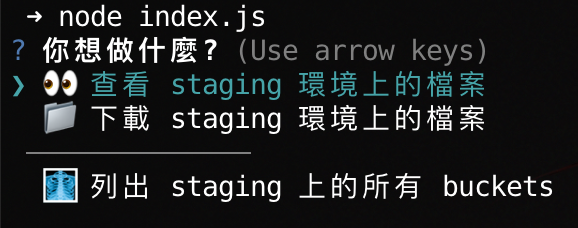

# AWS Tools

> 忘記了沒關係，程式碼會幫你記得

## 目的

aws 的 cli 指令相對複雜，這個工具可以省去那些重複翻找的時間

> 目前 infra 沒有提供圖形化介面給前端使用

## 事前準備

目前本地的驗證機制是假設使用者已經將 staging 環境的金鑰等存放在 `$HOME/.aws/credentials` 裡,  
並取名為 **staging**

```
[staging]
aws_access_key_id = MY-AWS_ACCESS_KEY_ID
aws_secret_access_key = MY-AWS_SECRET_ACCESS_KEY
```

具體操作流程可以參考 [AWS 官網](https://docs.aws.amazon.com/cli/v1/userguide/cli-configure-files.html)的 **long-term credential**

> TODO: 讓使用者可以選擇要用的 credential 或是直接輸入 id 和 accessKey

## 操作流程

```bash
# 安裝 packages
pnpm install

# 執行腳本
node index.js
```

接著依照選單做選擇即可

## 當前提供的功能



#### 查看 staging 上的檔案

會根據選擇的 brand, 把該 brand 在 staging 環境的 s3 資料，除了 logs 資料夾以外的 **檔案清單** 全部拉下來並存成 `.json` 檔

#### 下載 staging 上的檔案

會根據選擇的 brand, 把該 brand 在 staging 環境的 s3 資料，除了 logs 資料夾以外全部下載下來

> 會在下載前詢問是否連同 `static_resource` 資料夾也要下載

#### 列出 staging 上的所有 buckets

同標題描述，會將其清單結果存成 `.json` 檔案

### Reference

- https://docs.aws.amazon.com/sdk-for-javascript/v2/developer-guide/getting-started-nodejs.html
- https://docs.aws.amazon.com/sdk-for-javascript/v2/developer-guide/s3-node-examples.html
- https://docs.aws.amazon.com/AWSJavaScriptSDK/v3/latest/migrating/notable-changes/
- https://stackoverflow.com/questions/2685435/cooler-ascii-spinners
- https://aws.amazon.com/blogs/developer/announcing-end-of-support-for-aws-sdk-for-javascript-v2/
