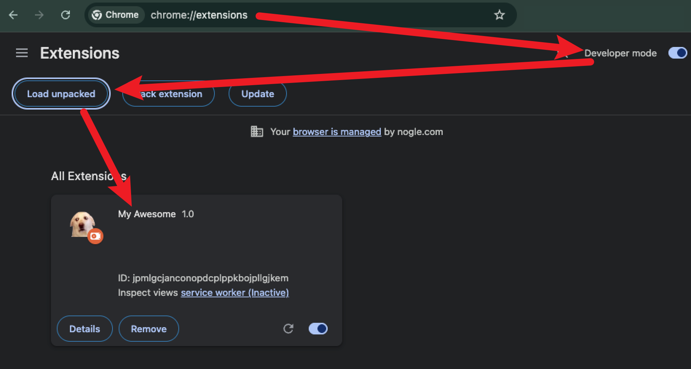
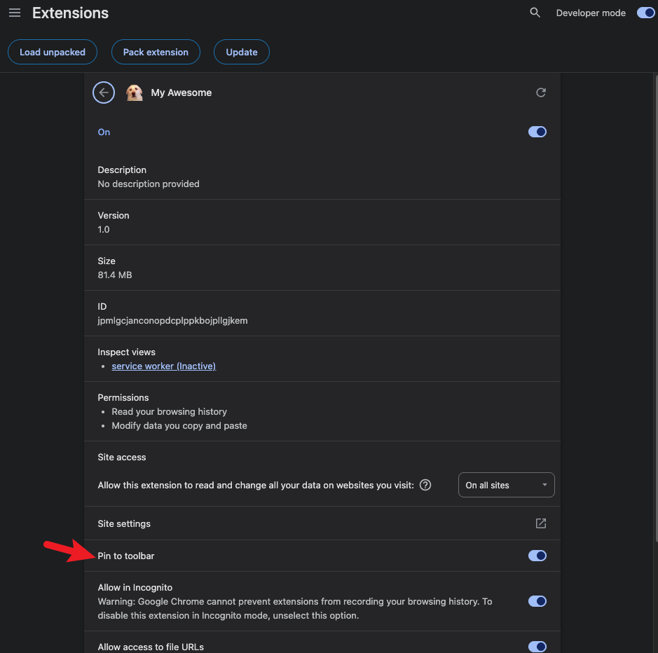
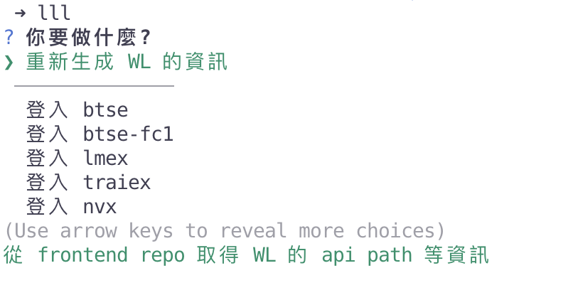
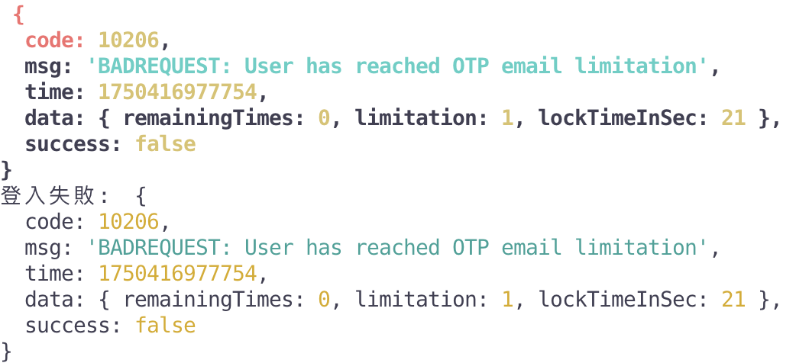
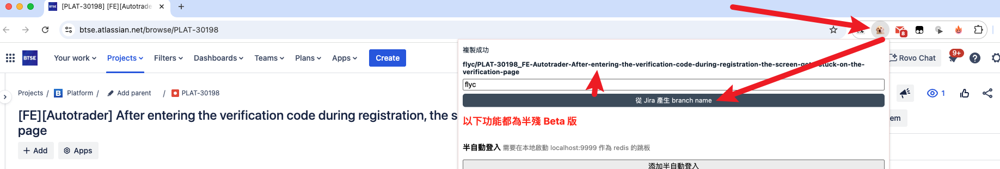
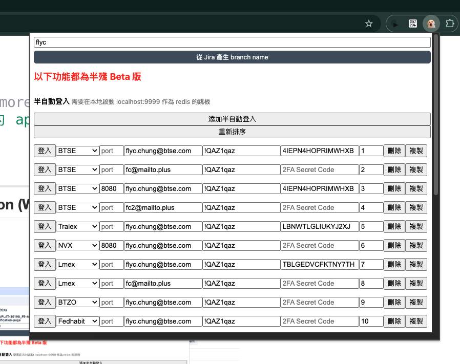

# My Awesome Magic Box

> Less is more.

這個專案包含了兩主要部分:

#### 1. 透過 terminal 操作的自動登入腳本

- 支持多個登入 profile 設定, 包含單一 WL 的多個帳號等
- 自動輸入 2FA 和 OTP
- 快取和 token 的健康檢查流程

#### 2. 協助日常開發的 Chrome Extension

- Jira 分支名稱生成器
  > 一鍵生成包含 jira 編號和描述的 branch name, 支持客製化與自動記憶使用者名稱
- 半自動登入系統(半殘)
  > 透過呼叫本地啟動的 api server 達成動態登入手動輸入的帳密
- Token 管理(半殘)
  > 快速取得/複寫當前頁面的 token 狀態

接著將針對這兩個功能做解說

---

## 透過 terminal 操作的自動登入腳本

### 如何使用

> 繁瑣的手把手

#### 事前準備 1: 從本地安裝當前 Chrome Extension 到瀏覽器

1. 造訪 [chrome://extensions/](chrome://extensions/)
2. 開始右上角的 `Developer mode`
3. 選擇左側的 `Load unpacked`
4. 直接選擇這整個專案的資料夾
5. 如果看到 `My Awesome` 出現在下面，就代表成功了



> 如果常用的話也可以點進 Detail 之後 pin 起來 
> 如果後面有更新的話，可以點擊右上角的 🔄 重新整理

#### 事前準備 2: 填好用於登入的 login profile 資料

1. 複製 `settings.json.default` 成 `settings.json`, 並修改其內容

```bash
# 當前這個專案
cp settings.json.default settings.json
```

`settings.json` 的內容範例

```json
{
  "loginProfiles": [
    {
      "displayName": "btse",
      "brandName": "btse",
      "email": "flyc.chung@btse.com",
      "password": "請輸入你的密碼",
      "secretCode2Fa": "請輸入你的 2fa secret code, 請注意是測試環境的，不要放成 prod 的了",
      "deviceFingerprint": "finter print 不輸入也沒關係, falsy 的話會變成一個預設的"
    },
    {
      "displayName": "btse-fc1",
      "brandName": "btse",
      "email": "fc1@mailto.plus",
      "password": "請輸入你的密碼",
      "secretCode2Fa": "",
      "deviceFingerprint": "btse-staging-fingerprint"
    }
  ],

  "brand-list": [], // 這裡的資訊會由 `❯ 重新生成 WL 的資訊` 這個功能生成

  "frontend-repo-path": "這裡要放 frontend repo 的絕對路徑，用於生成 brand-list 的部分",

  "redis": {
    "host": "10.1.34.152",
    "port": 6379
  }
}
```

> 當前 staging 環境的 redis host 為 `10.1.34.152`

以下為 `settings.json` 裡的 `loginProfiles` 的物件格式

| 屬性              | 是否必填 | 描述                                                                        |
| ----------------- | -------- | --------------------------------------------------------------------------- |
| displayName       | **Yes**  | 用於區分每個 login profile 的 primary-key, 同時也是 terminal 選項的顯示名稱 |
| brandName         | **Yes**  | 要登入的 brand 名稱 #註1                                                    |
| email             | **Yes**  | 就是 email                                                                  |
| password          | **Yes**  | 就是 password                                                               |
| secretCode2Fa     | No       | 如果有綁定 2FA(Google auth) 的話，請輸入當時生成用的 secret code (註2)      |
| deviceFingerprint | No       | 用於模擬裝置的 fingerprint, 輸入的是 falsy 的話會生成一個預設的             |

> 註1: 這邊對應的是 frontend repo 的 config/envConfig.js 裡面的 key, 如果要登入 BTSE 的話會是用 "btse"  
> 註2: 如果是用 [這個](https://chromewebstore.google.com/detail/authenticator/bhghoamapcdpbohphigoooaddinpkbai) 瀏覽器套件的話，可以透過他的 export 功能取得 secret code

#### 事前準備 3: 設定 terminal 的 alias 以利透過 terminal 指令執行腳本

> 這邊以 [`zsh`](https://www.zsh.org/) 作為範例 (註3)

請確認自己裝置的 家目錄 下有沒有 `.zprofile` 這個檔案，有的話可以直接操作，沒有的話可以創建一個空的

```bash
# 如果家目錄下沒有 .zprofile
touch ~/.zprofile
```

接著，在生成的 `~/.zprofile` 裡的最下面添加 `alias`, 讓此 `alias` _直接執行_ 當前這個專案的 nodejs 腳本

```bash
# ~/.zprofile

# ...

alias my_alias="node $當前這個專案的完整路徑/auto-login/t99.js" # 註4
```

設定完成後，需要重新執行一次 rc 和 profile

```bash
# 任何路徑
source ~/.zshrc;
source ~/.zprofile;
```

最後，測試 alias 有被正確設定即可, 會顯示方才設定的結果

```bash
# 任何路徑
type my_alias
```

> 註3: 如果是一般的 [`bash`](https://www.gnu.org/software/bash/), 對應的檔案為 `~/.profile` 和 `~/.bashrc`  
> 註4: 什麼是 `t99`?
>
> > 我也不知道，一瞬間閃過腦海的名字 by fc

#### 開始使用

先安裝需要的 `node_modules`, 這邊使用的是 [`pnpm`](https://pnpm.io/)

```bash
# 當前這個專案
pnpm install
```

接著，運行方才設定好的 terminal `alias`, 即可看到方才設定的 login profile 的資料被讀取成 selector, 依照選擇進行後續操作即可

```bash
my_alias
```

運行截圖:



> 截圖裡設定的快捷鍵是 `lll`

### 注意事項

- 💥 第一次運行時，設定檔裡的 `brand-list` 會是空的，記得執行一次 `❯ 重新生成 WL 的資訊` 這個指令
- 💥 是有可能登入失敗的，這個時候可以參考 terminal 裡的錯誤訊息，通常是 opt 的問題，可以去 admin 那邊解除
  > 

---

## 協助日常開發的 Chrome Extension (WIP)

#### Jira 分支名稱生成器

停在 jira 的頁面，然後給他點下去就好了，記得寫名字喔



#### 半自動登入系統(半殘)

目的為在瀏覽器套件上就可以輸入想要登入的地點和帳號密碼，不過因為需要一台 server 做 redis 的連線，所以目前半殘。

> 本地啟動的話是可以，但就沒有那麼方便

##### 本地啟動的方式

```bash
node auto-login/server.js
```

接著填入需要的資料就可以登入了



#### Token 管理(半殘)

可以取得當前頁面存在 localStorage 裡的 token 的小工具, 在想要直接將 token 從一個頁籤取出 or 同步到其他頁籤的時候有一點點點用處。

### TODO

更新 README

- cmdArgs 的部分

Captcha 如果是 geetest 的話，會出錯

- 會有 System error
- 可以在 autotrader 那邊看看

修改 brand 的替換邏輯

- btse -> 可以輸入 null 也可以輸入 "btse"
- nvx -> 可以輸入 "nvx" 也可以輸入 "btseid"

添加快捷
-> 登入 BTSE -> 可以輸入 'btse' 就會自動跳到 btse 的 option
