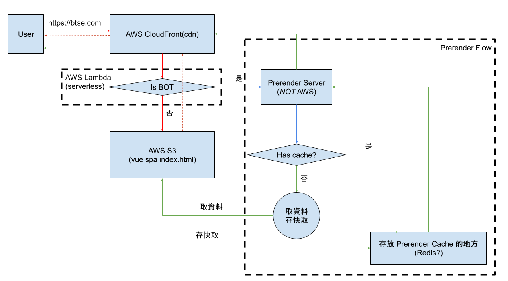
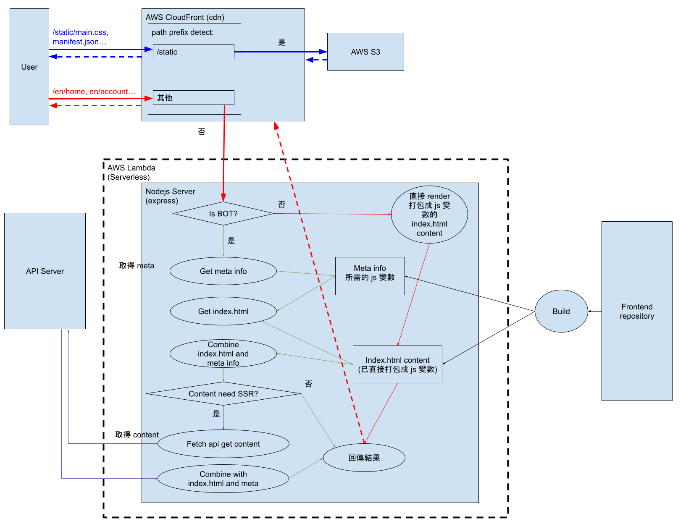
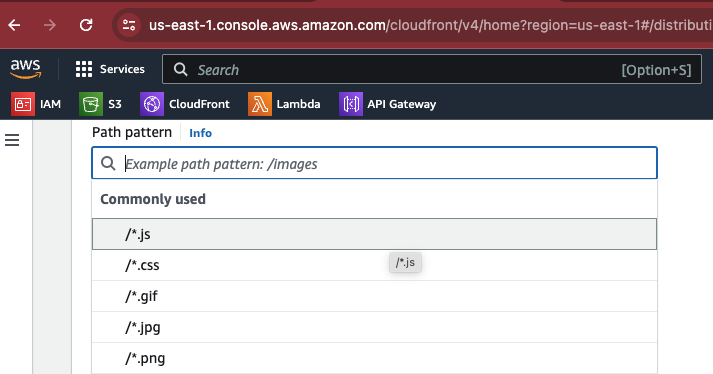
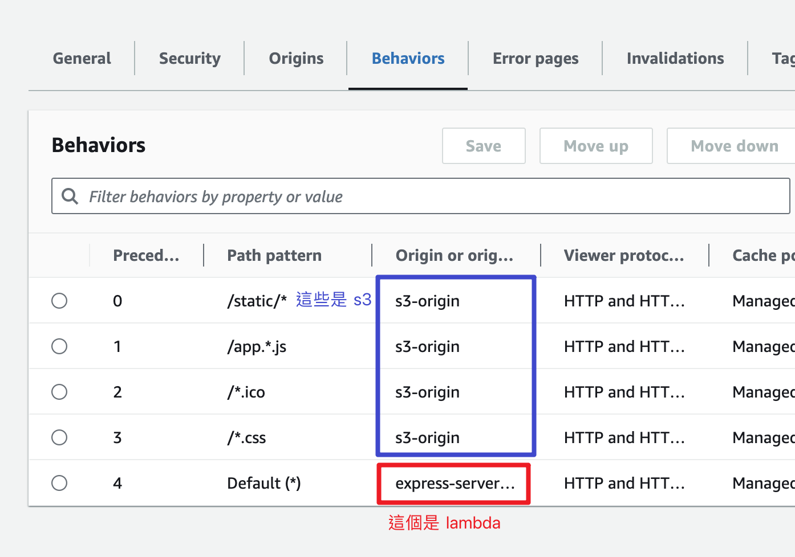

# little-tool

> 前端開發流程走 [這裡](./frontend-flow.md)  
> 整個 repo 的 CI/CD 流程走 [這裡](./cicd-flow.md)

### 當前的架構



AWS CloudFront(CDN) 收到請求, 將請求傳給 AWS Lambda 判斷當前請求是不是機器人

如果是機器人的話，執行 Prerender 的流程  
如果是人類的話，直接回傳交給 AWS S3 託管的 vue spa index.html

可以透過以下程式碼看出 UserAgent 是不是 BOT 的時候取到的 source code 差異

```js
// nodejs environment
import fetch from 'node-fetch'
const URL = 'https://btse.com'

function start() {
  fetch(URL, {
    // 將這個 User-Agent header 移除，就可以看到沒有 prerender 的版本
    headers: { 'User-Agent': 'Googlebot/2.1' }
  })
    .then(r => r.text())
    .then(console.log)
}
start()
```

### 目標

1. 移除 AWS 上用來判斷 `是不機器人` 和 `有沒有包含 prerender header` 這兩個部分的 Lambda

2. 移除 prerender

3. 在上述條件下，維持網站的 SEO

> 在需達成上述目標的同時，也須考量 **安全性** 和 **負載量**  
> ~~Infra 有提過說在現有架構下添加 headers 會有**很高的風險** + **很不好調整**，這部分要確認新架構是否也會有這個問題~~  
> 因為前端的資源檔案需要 `support compression(也就是 Brotil 或 Gzip 的壓縮)`,  
> 而 `Prerender` 所需要的 header 得要用 `Legacy cache settings` 的設定才能客製化 (待梳理詳細流程)  
> 所以壓縮的這部分所需要的 header(`Content-Encoding`) 添加邏輯就得自己處理  
> 調整架構後， aws 現有的 `cache policy and origin rquest policy` 就可以相當簡易地配置 Compression 所需的 headers

### 調整方案:



由 CloudFront(CDN) 判斷 request 的 path,
如果是靜態資源的話，全部指向 `s3://xxxx.yyy/webpages`

> 例如: `/static/main.xxx.css`, `/static/abc.[hash].js`, **`/app.[hash].js`**, **`/robot.txt`**...  
> 透過設定 Cloutfront(cdn) 的 behavior 處理
> 

其他請求，全部導向部署在 `AWS Lambda` 的 Nodejs server

> 例如: /en/login, /en/home, /en/account

Nodejs 的 server 要做的事情如下:

~~- 判斷是不是機器人，如果**不是**的話直接回傳 `s3` 上面的 `index.html` 檔案 (aws sdk)~~

- 改成在打包 node server 的階段就會把 `index.html` 直接變成一個 javascript variable, 直接使用

- 如果**是**機器人的話

  1.  呼叫 api 取得 meta 的資料
  2.  ~~透過 [aws-sdk](https://www.npmjs.com/package/@aws-sdk/client-s3) 取得 s3 上的 `index.html` 文本~~
  3.  直接取用打包成 string 變數的 `index.html` 內容
  4.  結合兩個資料

> 要請 backend 添加 `Access-Control-Allow-Origin`

- 判斷當前頁面是不是連同 content 也需要 ssr

1. 不需要的話回傳方才組合好的 meta 和 `index.html` content
2. 需要的話呼叫 api 取得 content 內容，與 `index.html` content 結合後回傳

##### 優點

BOT 可以有 SSR  
架構簡單，不會動到前端的商業邏輯

##### 潛在問題

BOT 的部分,  
HTML 的結構裡 `<head>` 裡的 `<meta>` 部分沒有問題，不過如果有**連同內容也需要 SEO 的頁面**，  
會**沒有和一般 user 一樣的回傳結構**。  
目前規劃為在取回資料後，直接渲染一個簡易的 HTML 結構做 SEO。

server.js 裡關於 routes 的判斷邏輯的同步問題，像是哪些頁面需要 SEO 哪些又不需要的時候的整合調整等。

> 目前無法單獨 export 出 routes 的內容，手動同步優先

##### 會放在 Nodejs server 的檔案有哪些? 預計的檔案大小有多大?

僅會有透過 rollup 打包過後的若干支 js 檔案  
預計檔案大小不會超過 1 ~ 2MB

## AWS 相關設定

先安裝 [AWS-CLI](https://docs.aws.amazon.com/cli/latest/userguide/getting-started-install.html)

### 權限部分

創一個 AWS IAM 的帳號  
給他 `s3:ListBucket`, `s3:GetObject`, `s3:PutObject` 和 `s3:DeleteObject` 的權限，可以**僅指定某一個 bucket**  
給他 `lambda:UpdateFunctionCode` 的權限，可以**僅指定某一個 lambda**  
把這個 IAM 的 secret-key 拉出來，在 cli 創一個 profile

```bash
aws configure --profile <PROFILE-NAME>
```

接著按照 cli 的指示輸入對應的 name 或 key  
創建完畢後可以在 `~/.aws/credentials` 裡看到自己方才創建的 profile detail  
會長得像這樣

```ini
[<PROFILE-NAME>]
aws_access_key_id = XXXXXXXXX
aws_secret_access_key = YYYYYYYYY/ZZZZZZZZZ
```

### S3 部分

創一個 bucket, 裡面要放 `static` 和 `lambda-code.zip` 等東西  
同時要開權限(bucket policy)給 `cloudfront` 可以來這裡拿東西

### Lambda 部分

創一個 s3 bucket 放 lambda codes

> 在上一個步驟的 `lambda-code.zip` 的部分

創一個 lambda 吃上面的 s3 bucket 裡面的 code  
創一個 api gateway 作為 lambda 的觸發器, path 是 $default

#### Lambda 本身的權限設定

為了避免每次更新都要一起更新 lambda，所以 `index.html` 的部分要從 lambda 去 s3 取，  
這邊就會需要開可以讀取 s3 的權限給 lambda。

> 不知道這樣會不會比直接放在 lambda 裡面用 fs 去取資料來得慢就是了

到 IAM -> 左邊的 Role -> 搜尋框輸入 lambda name -> Permissions policies 那裡添加一個 `Create Inline Policy`  
直接用 JSON 的方式看的話 policy 如下

```json
{
  "Version": "2012-10-17",
  "Statement": [
    {
      "Sid": "VisualEditor0",
      "Effect": "Allow",
      "Action": ["s3:GetObject", "s3:ListBucket"],
      "Resource": [
        "arn:aws:s3:::{YOUR-BUCKET-NAME}",
        "arn:aws:s3:::{YOUR-BUCKET-NAME}{SPECIFIC-FILE-NAME-START-WITH-SLASH}"
      ]
    }
  ]
}
```

記得調整這兩個: `YOUR-BUCKET-NAME` 和 `SPECIFIC-FILE-NAME-START-WITH-SLASH`  
在這裡如果之前上傳是整個 `dist` 資料夾上傳上去的話，  
`SPECIFIC-FILE-NAME-START-WITH-SLASH` 就會是 `/dist/index.html`

#### Lambda 的開發

寫 code  
zip 打包  
透過 aws-cli profile 上傳 code 到 s3  
透過 aws-cli profile 把 s3 上的 code 部署到 lambda  
反覆測試

### Cloudfront 部分

創一個 distribution  
在這個 distribution 創一個 `origin access`, `origin type` 選 `s3`  
接著在這個 distribution 裡面創兩個 `origins`, 一個是 `s3` 一個是 `api-gateway` (方才作為 lambda 觸發器的那個)  
其中 `api-gateway` 這邊可以添加 custom request headers  
而 s3 的 `origin access` 要選 `Origin access control settings(recommended)`, 然後 `origin access control` 選剛剛創好的那個 `origin access`

> 在這個階段是 cloudfront 要去 s3 拿資料，所以 s3 要開權限給 cloudfront  
> s3 -> bucket -> permission -> bucket policy -> 貼上這個, 替換 resource 和 arn

```json
{
  "Version": "2008-10-17",
  "Id": "PolicyForCloudFrontPrivateContent",
  "Statement": [
    {
      "Sid": "AllowCloudFrontServicePrincipal",
      "Effect": "Allow",
      "Principal": {
        "Service": "cloudfront.amazonaws.com"
      },
      "Action": "s3:GetObject",
      "Resource": "arn:aws:s3:::<YOUR-BUCKET-NAME>/*",
      "Condition": {
        "StringEquals": {
          "AWS:SourceArn": "<YOUR-CLOUDFRONT-DISTRIBUTION-ARN>"
        }
      }
    }
  ]
}
```

> https://repost.aws/knowledge-center/cloudfront-access-to-amazon-s3

接著添加 Behavior, 指定 `/static/*`, `/*.js`, `/app.*.js` 等等靜態資源去 s3,  
然後 `$default` 去 `lambda`



### AWS 指令參考

```bash
# 列出 s3 上的資源
aws s3 ls staging-render.btse.co \
--profile staging

# 上傳檔案到 s3 上
aws s3 cp render-server.zip s3://staging-render.btse.co/render-server.zip \
--profile staging

# 列出 lambda functions, 目前應該沒有這個權限
aws lambda list-functions \
--region ap-northeast-1 \
--profile staging

# 把在 s3 上的 code 部署到指定的 lambda
aws lambda update-function-code \
--function-name staging-render \
--s3-bucket staging-render.btse.co \
--s3-key render-server.zip \
--region ap-northeast-1 \
--profile staging

# 清除 cloudfront(cdn) 的 cache
aws cloudfront create-invalidation --distribution-id E1VCZ1L5W2HTOJ --path '/*' --profile staging
```

### 其他指令參考

打包 server 需要的檔案們 (用了 rollup 後已用不到)

```bash
yarn workspaces focus --production # 讓 node_modules 只剩下 production 的東西
zip -r render-server.zip node_modules yarn.lock package.json index.js utils.js
```

打包 + 上傳 frontend repo 的檔案到 s3 (for 測試使用)

```bash
cd {FRONTEND_REPO_PATH}
yarn build-staging # 因為是測試的所以這邊也是打包 staging 的版本即可
aws s3 cp ./dist s3://staging-render.btse.co/webpages --profile staging --recursive
```

---

### Nodejs Server 具體實作方式

##### 需要的程式版本

| Application | Version  |
| ----------- | -------- |
| nodejs      | v18.17.1 |
| yarn        | 3.5.0    |

##### 大小限制

壓縮前不可超過 **250MB**

> https://blog.awsfundamentals.com/lambda-limitations  
> https://docs.aws.amazon.com/lambda/latest/dg/gettingstarted-limits.html

原 SPA 專案打包出來的 `dist/` 通常會由一個 `server.js` 去做 `host`,  
其 `server.js` 的路由結構會將所有的路由，也就是 `*` 全都指向 `dist/index.html`.

```js
// server.js
// ...
app.get('*', (req, res) => {
  res.sendFile(path.resolve(__dirname, 'dist/index.html'))
})
// ...
```

為了要有 SEO, 所以在 `*` 這個路由返回 `dist/index.html` 之前，  
需透過匹配路由表的方式，`找到`/`組合`/` api 取得`每一個路由表所需的 SEO 資訊後，  
再透過 `cheerio` 處理好最後輸出的文本格式後 `html`  
最後返回給使用者。

```js
// server.js
// ...
app.get('*', async (req, res) => {
  const htmlContent = fs.readFileSync(distPath, 'utf8')
  const htmlContentWithSeo = await doSomethingSeoStuff(url, htmlContent)
  res.send(newHtmlContent)
})
// ...
```

上面是基礎範例，其中 index.html 文本的部分會用已經打包成 javascript variables 的字串, 內容是 `index.html` 的內容

如果是連同內容也需要 SEO 的頁面，除了自己組合以外還有其他的方式可以參考:

1. 直接呼叫需要的 api、產出最基本的 SEO html 內容後回傳

```js
const data = await fetchApi(url)
const content = dataToHtml(data)
res.send(content)
```

~~2. 將內容頁面定期/即時將內容 build 成靜態檔案放在 S3 上， nodejs server 再去 S3 上直接取得靜態資源~~

```js
res.send(await fetchFromS3(url))
```

> 暫時不考慮這種做法，如果有其他瓶頸再討論

### 還沒處理的問題

- 整體的 CICD 流程
- ~~cloudfront 的 path prefix 判定~~
  > 已透過 behavior 設定
- ~~從 nodejs server 對後端發 api 請求~~
  > 已請後端同學添加 `Access-Control-Allow-Origin`
- ~~如果 cloudfront 沒辦法處理 path 或是有其他問題的話，從 nodejs server 發出靜態資源請求的方式~~
  > cloudfront 可以處理，透過 aws sdk 取得 s3 的資源也沒問題

### 目前有遇過的問題

1. ~~初次啟動的時候，不知道為什麼遇到了 `400 Bad Request, Invalid cookie value` 的問題,~~  
   ~~就算是重新啟動的 serverless 也遇到這個問題，清除 Cookie 後恢復正常，~~  
   ~~推測是因為 port 號與之前啟動的專案重複、有一些沒清乾淨的 localhost 資料的關係?~~

> ~~清掉之後，重啟伺服器，關閉，再重啟，可以覆現~~  
> 目前透過 AWS 跑整個流程後沒有遇到這個問題

2. ~~api 請求發出去的時候會缺少白牌的名稱所以打不到，這個要看 `frontend` 的設定~~

   > ~~部署到正確的 domain 後應該就會解決了?~~  
   > 已經可以透過打包的方式把 brand-name 直接傳過來了

3. ~~在 aws 透過 lambda function url 觸發 lambda 腳本的時候沒辦法處理像是 `/path/[][][]][[` 這種奇怪的路由，~~
   > lambda 的觸發器多封裝了一層 api gate way 的話就可以處理這個問題  
   > aws lambda -> configuration -> trigger

#### 參考資料

https://docs.aws.amazon.com/cli/latest/userguide/getting-started-install.html  
https://gist.github.com/RakaDoank/05da35887051a8f999aabc23d30194e3  
https://www.serverless.com/framework/docs/tutorial  
https://www.serverless.com/blog/serverless-express-rest-api  
https://aws.plainenglish.io/deploying-a-node-express-api-on-aws-lambda-c9730a17f932  
https://blog.awsfundamentals.com/lambda-limitations  
https://docs.aws.amazon.com/lambda/latest/dg/gettingstarted-limits.html  
https://repost.aws/knowledge-center/cloudfront-access-to-amazon-s3  
https://docs.aws.amazon.com/zh_tw/lambda/latest/dg/nodejs-handler.html
https://stackoverflow.com/questions/31329958/how-to-pass-a-querystring-or-route-parameter-to-aws-lambda-from-amazon-api-gatew  
https://docs.aws.amazon.com/zh_tw/AmazonS3/latest/userguide/example_s3_GetObject_section.html

#### TODO

cache key introduction  
br, gzip 壓縮  
Function associations with Lambda@Edge  
實際添加 headers 的時候的難題梳理  
brotli 和 gzip 如果可以直接交給 cloudfront 的話，打包流程那邊可不可以跳過這部分?  
-> 之前說不定是因為沒有辦法使用 cloudfront 的 compression, 所以才要自己打包?  
frontend 那邊上傳 dist 等等到 s3 上的 script: 這個是 for 測試用的  
做一個簡單的邏輯, 處理本地要怎樣比較快開發  
繼續寫這邊的 code
