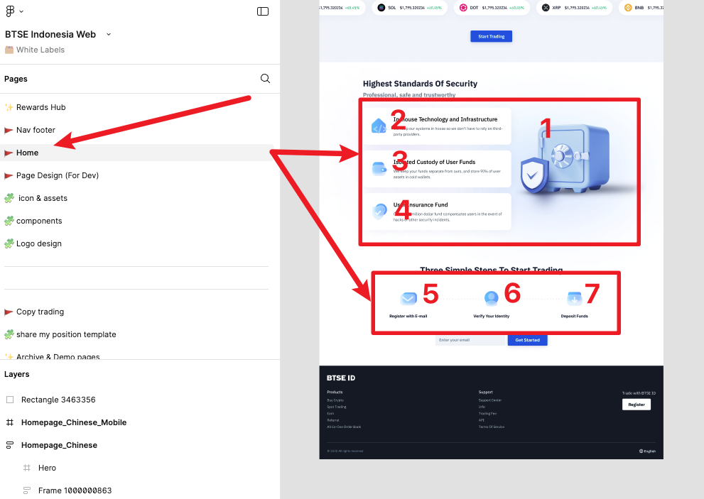
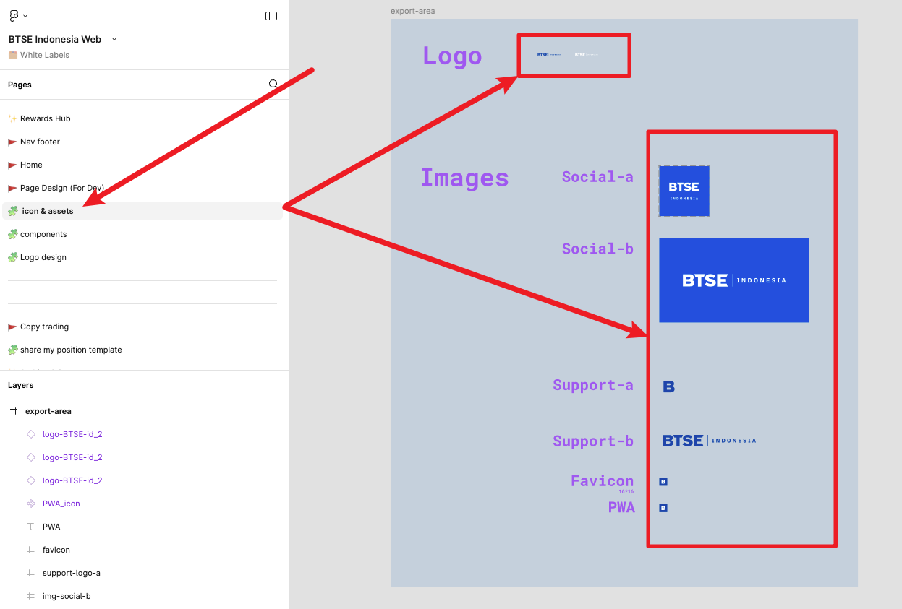

# 創建/修改一個白牌的時候可以用的工具

> 大部分還是需要手動就是了

## 環境

| Application | Version |
| ----------- | ------- |
| Nodejs      | 18^     |

## 怎麼用

```bash
# 安裝 pacakges
pnpm install

node index.js
```

接著照著跳出來的提示處理想做的事情即可

## 處理細節

#### 我想要看白牌要調整的項目的清單

列出各種需要留意的地方，但可能還是沒辦法齊全

#### 同步 assets 相關的檔案

首頁相關的那些  


#### 同步 LogoLight 和 LogoDark

SVG 的部分，會調整成可用的 .vue 的形式, 使用的 template 在 [LOGO_TEMPLATE.txt](./LOGO_TEMPLATE.txt) `

#### 同步 S3 那裡的 LogoLight 和 LogoDark

S3 Logo 的部分, 不含其它如 referral, task-and-reward 等等

#### 將從 figma 上載下來的檔案直接轉換到 new-images/static 資料夾中

解壓縮相關的檔案到指定路徑，就可以動態產稱可用的 static 靜態檔案  


#### 同步 static 相關的靜態檔案

各種尺寸的 logo, 像是 PWA 和 favicon 等等

## TODO

1. btse-s3 那個 repo 的其他各種圖片上傳 (referral 的 banner(login/out), lighten...), email, task-and-rewrard 等等

   > 可以用 checkbox

2. email 那個 repo 的各種檔案的上傳自動化(包含 Logo) 如果有的話

3. 傳入 figma 網頁，自動取出相對應的圖片等等
