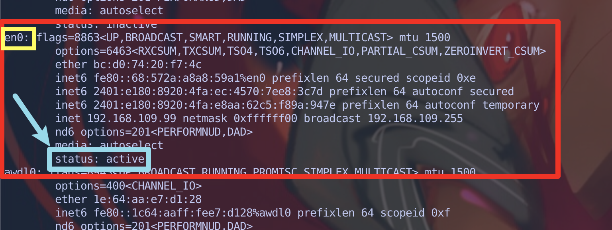

# How to monitor network request

> Trying to create a simple tool for monitoring request sending via the command line.

### Here we go

First of all, find out which network device is used currently by `ifconfig -a`

```bash
ifconfig -a
```

Output:



`ifconfig` will list all network devices of this machine. Find out which device status is `active`.

Then, use `tcpdump` to monitor it by its name.

```bash
# Don't forget the `sudo`
sudo tcpdump -i {THE_NETWORK_DEVICE_NAME} -s 0 -w http.pcap port 80
```

> In my previous test, the network device name is `en0`
