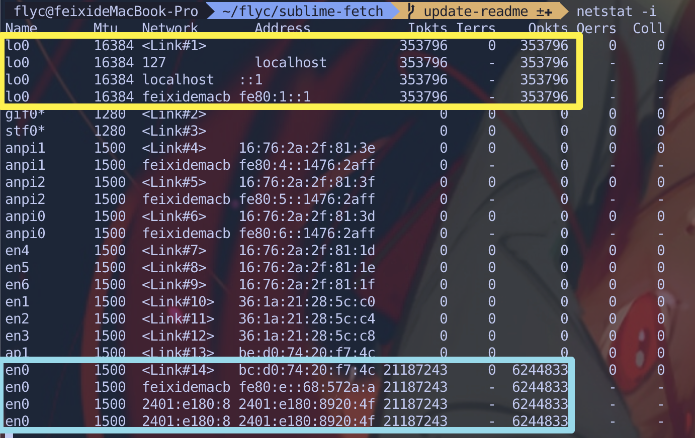

# [WIP] How to monitor network request

> Trying to create a simple tool for monitoring request sending via the command line.

### Here we go

First of all, find out which network interfaces is used currently by `netstat -i`

```bash
netstat -i
```

Output:



Find out which interface has `Ipkts` and `Opkts`, which represent its `input packet` and `output packet`.

> Notice: the interface `lo0` is used for inner connections on Mac and may not be the one you are looking for.

Then, use `tcpdump` to monitor it by its name.

```bash
# Don't forget the `sudo`
sudo tcpdump -i {THE_NETWORK_DEVICE_NAME} -s 0 -w http.pcap port 80
```

> In my previous test, the network interface name is `en0`

> > `[TODO] Details of parameters haven't been filled in yet`
