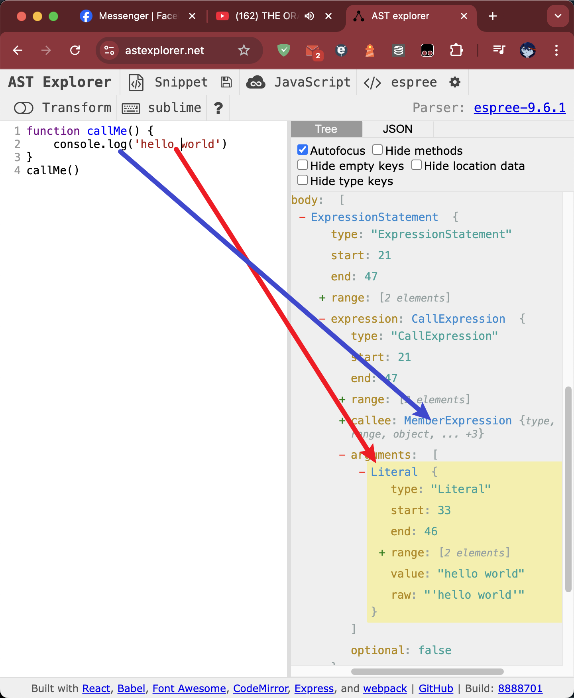

# 創建屬於自己的 eslint-plugins

> 當前的 version: `^8.29.0`  
> 寫完了，但只是搬移過來，還沒有實際嘗試 demo codes 有沒有 bug

### 基礎建設

1. 創建一個新的資料夾，名稱可以隨便取，這邊選用 `custom-eslint-plugins`

2. 在這個資料夾裡面，創建另外一個資料夾，這個資料夾的名字會是你的 **plugin 的名字**  
   這邊使用 `you-shall-not-pass`

3. 在 `custom-eslint-plugins/you-shall-not-pass` 裡，透過 `npm init` 開啟一個新專案

```bash
npm init
```

專案名稱 **必須** 是 `eslint-plugin-` 開頭，這邊使用 `eslint-plugin-you-shall-not-pass`,  
創建出來的 `package.json` 預計會是這樣

```json
{
  "name": "eslint-plugin-you-shall-not-pass",
  "version": "1.0.0",
  "description": "you shall not pass",
  "main": "index.js",
  "scripts": {
    "test": "echo \"Error: no test specified\" && exit 1"
  },
  "author": "flyc",
  "license": "ISC"
}
```

在 `package.json` 同層級加上與內容的 `main` 對應的檔案: `index.js`,  
這個檔案會 export 出來一個 object, 裡面有 `rules`  
這個 `rules` 的 keys 就是當前這個 plugin 所擁有的 rules' name, 所以會是成這樣

```js
module.exports = {
  rules: {
    'my-rule-1': {
      /* ... */
    },
    'my-rule-2': {
      /* ... */
    },
    'my-rule-3': {
      /* ... */
    },
  },
}
```

接著，為了 demo 方便，先創個簡單的 rules 如下，  
這個 demo 會讓所有的 function call 都出現錯誤訊息。

```js
module.exports = {
  rules: {
    'my-rule-1': {
      create: function (context) {
        return {
          CallExpression(node) {
            context.report({ node, message: '這裡是錯誤訊息' })
          },
        }
      },
    },
  },
}
```

創建完畢後，需要把這個 eslint plugin 安裝到原專案裡  
請留意方才寫到的資料夾名稱等等

```json
// package.json
{
  // ...
  "devDependencies": {
    // ...
    "eslint-plugin-you-shall-not-pass": "file:custom-eslint-plugins/you-shall-not-pass"
    // ...
  }
  // ...
}
```

接著，要到 `.eslintrc.js` 這裡告訴 eslint 說要安裝的 plugin 和要設定的 rules

```js
// .eslintrc.js
{
  // ...
  plugins: ['import', 'you-shall-not-pass'],
  rules: {
    'you-shall-not-pass/my-rule-1': 2,
  },
  // ...
}
```

最後，重新執行 npm packages 的安裝後，重啟 IDE 的 eslint extension 即可

### 調整

> 這邊僅會介紹比較常用的部分，  
> 詳細文件請參考[官網](https://eslint.org/docs/v8.x/extend/custom-rule-tutorial#the-custom-rule)

程式碼會被 parser 轉換成 AST, 然後再透過撰寫解析 AST 的 code 來達到 eslint 要做的事情。  
而解析後的 AST 長什麼樣子，可以透過 https://astexplorer.net/ 這個網站來看。  
這邊以 js 先做例子:



可以看到在經過 parser 的轉換後，每一個位子都會有對應的樹狀關係，這個關係就叫做 AST,  
而在 eslint 的 rules 裡撰寫的就是這個 **名字**: `CallExpression` 就是 function call, `MemberExpression` 就是 object.key 等等  
所以在上面的例子才會讓所有的 function call 都回報一個錯誤訊息。

知道了這件事情之後，剩下的就是如何撰寫適合的邏輯了。

#### 常見問題

##### 怎麼回報錯誤?

```js
'error-report-demo': {
  create(context) {
    return {
      CallExpression(node) {
        context.report({ node, message: '這裡是錯誤訊息' })
      },
    }
  }
},
```

紅框框起來的範圍就是傳進去的 node 範圍，所以可以 selector 是 `CallExpression`, 但紅框是其 `node.parent` 之類的

##### 自動修復

自動修復要在 rules 除了 create 以外，多添加 meta 等訊息告訴 eslint 這個可以修,  
這裡的例子是檢查 `<i18n-t></i18n-t>` 這個 `vue-component` 的 attributes 有沒有缺,  
有的話自動補上

```js
module.exports = {
  rules: {
    'fix-demo': {
      meta: {
        fixable: 'code', // 這裡
      },

      create(context) {
        const sourceCode = context.getSourceCode() // 用於取得原始碼的 constance

        return context.parserServices.defineTemplateBodyVisitor({
          // 找到檔案中的 <i18n-t></i18n-t>
          'VElement[name="i18n-t"]'(node) {
            // 檢查 <i18n-t></i18n-t> 的 startTag, 有沒有 key 是 global 然後 value 是 global 的屬性
            const hasScopeAttr = node.startTag.attributes.some(
              (attr) => attr.key.name === 'scope' && attr.value.value === 'global'
            )

            // 如果沒找到的話跳提示，同時提供修復的方式
            if (!hasScopeAttr) {
              return context.report({
                node: node.startTag, // 讓紅框僅限於 start-tag 的位置
                message: '這裡是錯誤訊息',

                // 修復方式: 取出 node.startTag 的原始碼，然後在最後面添加需要的屬性
                fix(fixer) {
                  const code = sourceCode.getText(node.startTag)
                  const computedCode = `${code.slice(0, -1)} scope="global">`

                  // fixer 本身有提供許多 methods 可以使用, 詳見附註
                  return fixer.replaceText(node.startTag, computedCode)
                },
              })
            }
          },
        })
      },
    },
  },
}
```

> fixer 文件: https://eslint.org/docs/latest/extend/custom-rules#applying-fixes

##### Vue 的 parser 是什麼?

> https://eslint.vuejs.org/developer-guide/  
> https://github.com/vuejs/vue-eslint-parser/blob/master/docs/ast.md

Vue 的 template 和 script 用的 parser 是不一樣的，所以在 rule 裡的 `create` 要多加這層才可以取得對應的 AST 節點,  
這邊用的 parser 是 [`vue-eslint-parser`](https://eslint.vuejs.org/)

```js
'my-vue-template-rule': {
  create(context) {
    return context.parserServices.defineTemplateBodyVisitor({

      // 這裡就是一樣的了
      CallExpression(node) { /* ... */ },

      // 也可以透過這種方式直接找到 <my-component></my-component>
      'VElement[name="my-component"]'(node) { /* ... */ }
    })
  }
},
```

### Reference

https://chihyang41.github.io/2021/06/29/AST-and-ESLint-Introduction-part-2/
